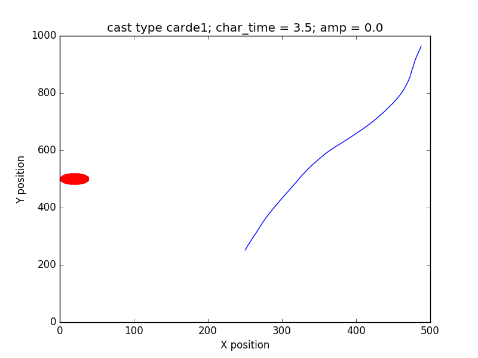

`moth` is a NumPy based implementation of moth-inspired navigation strategies that uses 
`pompy` library to create the puff, wind and concentration models. see `pompy/Readme.md` 
for details

### What is this repository for?

This Python package allows simulation moth-like navigators in dynamic 2D odour 
concentration fields spread in turbulent flows 

### Installation and requirements

    Python 2.7
    Numpy
    Scipy
    Matplotlib


### Example usage

``` 

python compare\ navigators\ in\ different\ wind\ conditions.py

```


