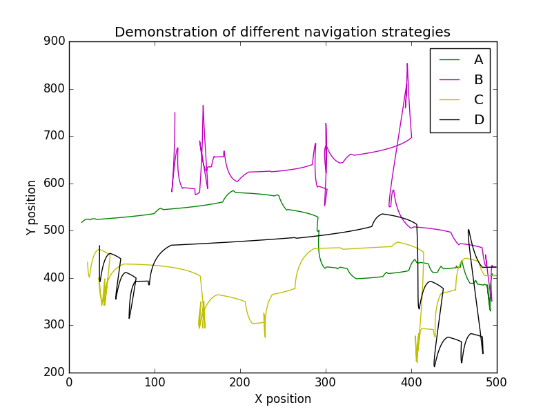

`moth` is a NumPy based implementation of moth-inspired navigation strategies that uses 
`pompy` library to create the puff, wind and concentration models. see `pompy/Readme.md` 
for details

### What is this repository for?

This Python package allows simulation moth-like navigators in dynamic 2D odour 
concentration fields spread in turbulent flows 

### Installation and requirements

    Python 2.7
    Numpy
    Scipy
    Matplotlib

### Example usage

``` 

python compare\ navigators\ in\ different\ wind\ conditions.py

```




## How to build the figures for the paper

#### Set up the navigators (optional) 
The file Casting_competition initiates the navigators to compete in the simulation. Four loops initiate four equal sized groups of navigators, their properties can be changed within these loops - navigation and casting strategies, location, and so on. 
For more information about navigators check out the models file. 
#### Set up the wind and plume conditions (optional) 
The file Compare_navigtors... initiates the main loop. For each iteration a new plume and wind model are initiated for the simulation to occur in. The function generate_job dictates the terms of the simulation in terms of wind and plume partameteres. In order to set the simulation enter the required parameters as input for generate_job. For example here - 
```
    for i in range(4):
        job_file_name = 'job'+ str(i)+ '.json'
        data_file_name = 'data'+ str(i)+ '.json'
        #titles_file_name = 'titles'+ str(i)+ '.json'       
        generate_job(char_time = 3.5, amplitude =0.1, job_file = job_file_name,
                     t_max =15, puff_release_rate = 100,
                     puff_spread_rate = 0.0001*(1+i),
                     dt = 0.01, num_it = 1)
```
The only value that changes is the puff spread rate, varying from 0.0001 to 0.0004.
Make sure that only one variable of the simulation changes with each iteration. Multivaribale changes will create problems later on.
#### Run Comapare_navigators... 
When the file is run the wind and plume paramters that have been set are saved into "job" files, one JSON file for each iteration (job0.JSON, job1.JSON...). 
The trajectories of the navigators are saved as "data" files, (data0.JSON, data1.JSON), on which the later analyses will be made. 
Notice the following line - 
```
#save_plot(job_file_name,data_file_name,title,navigator_titles)
```
deleting the # mark would instruct the code to save an image for each navigation attempt in the deafulat settings, that mean 800 pictures). That could supply useful input in some cases. 
#### Run Line_graphs 
The file line_graphs plots bar graphs of the four different simulations. It read from the Data and Job files, so those could be replaced and . There is no need to set up anything for this file, just run it.
The output should look like this: 


